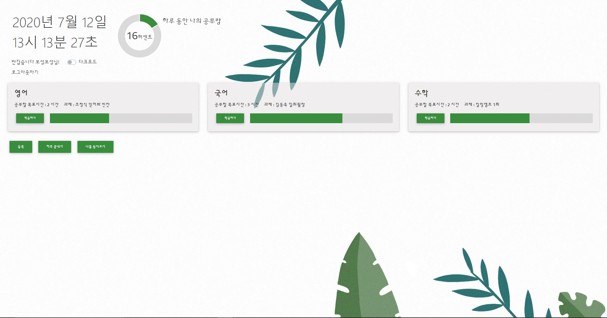
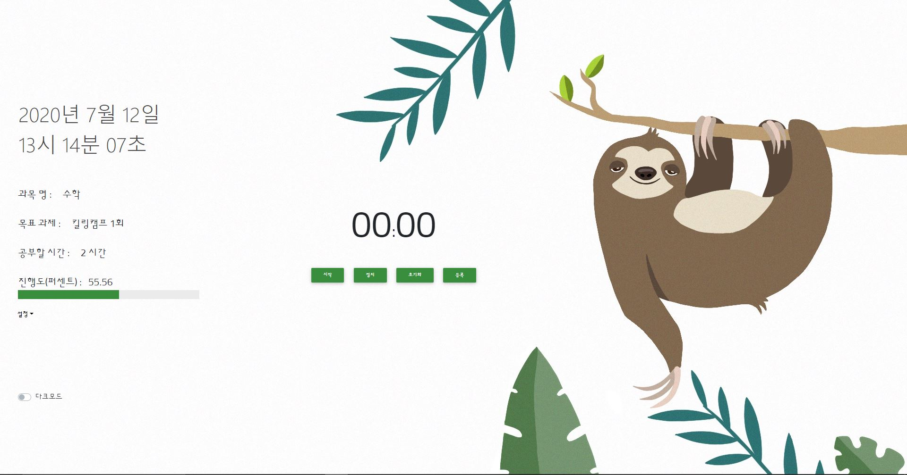
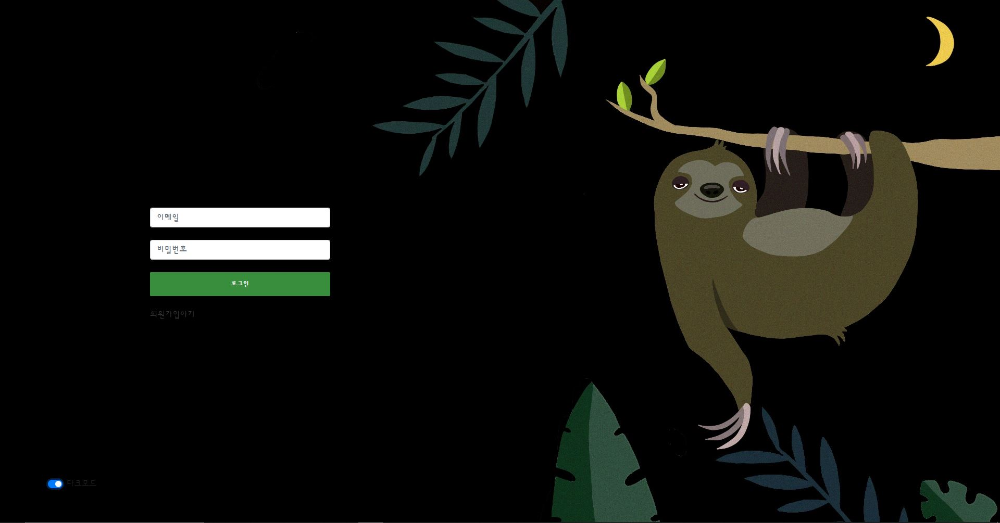
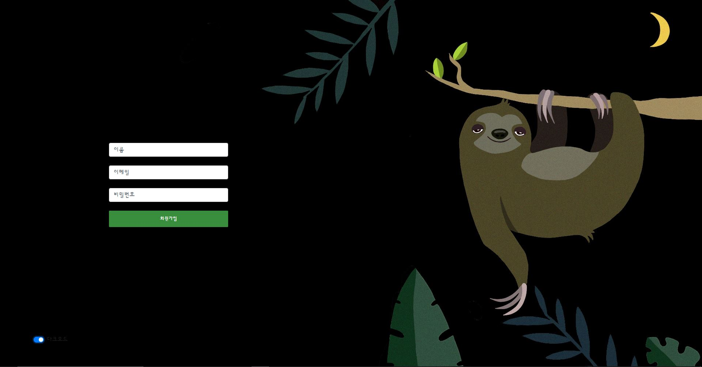
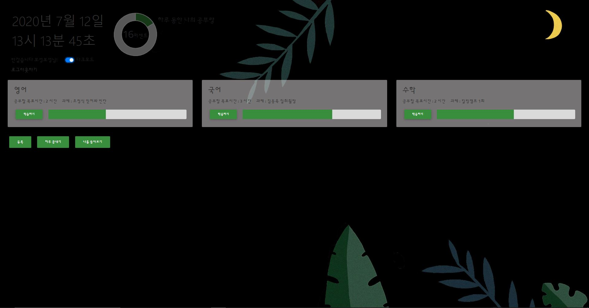
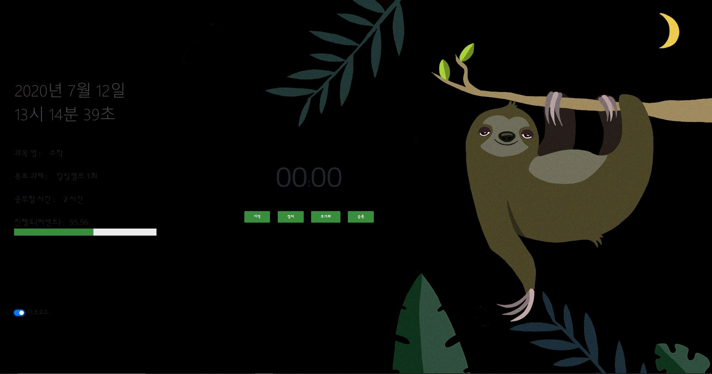
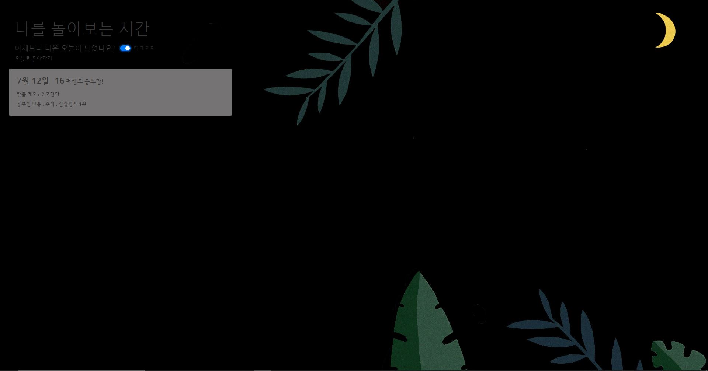

# 나무늘보처럼 살고싶다	

온라인 기반의 웹 스터디 플래너

```
cd myapp
npm install
mkdir data
mongod --dbpath=data
```

### 라이트모드 UI


메이 페이지

로그인 페이지

회원가입 페이지

마이 페이지

상세조회 페이지

하루정리 확인 페이지

***

### 다크모드 UI


메이 페이지

로그인 페이지

회원가입 페이지

마이 페이지

상세조회 페이지

하루정리 확인 페이지

